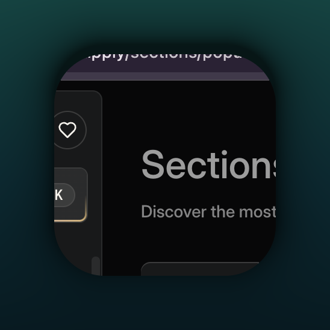
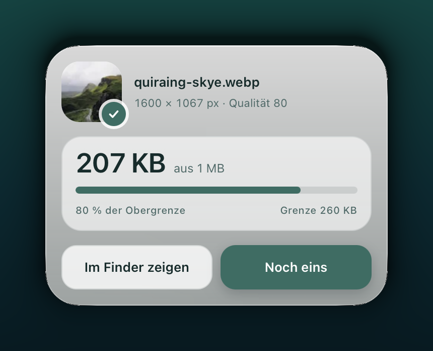

# Preen

Preen macht Bilder web-fertig: Foto hineinziehen, Name eintippen, fertig ist
eine WebP-Datei, die unter einer Größengrenze bleibt und trotzdem gut aussieht.
Die App liegt als kleines Panel auf dem Schreibtisch, ist über ein Tastenkürzel
da und wieder weg, und rechnet alles auf dem eigenen Rechner.

<p align="center">
  
  &nbsp;&nbsp;&nbsp;
  
</p>

## Installieren

1. Die neueste `Preen.dmg` unter [Releases](../../releases) laden.
2. Öffnen und **Preen.app** nach **Programme** ziehen.

Apple Silicon, macOS 11 oder neuer.

## Beim ersten Start sagt macOS „beschädigt“

Das wird passieren, und die App ist in Ordnung. macOS sagt das über jedes
Programm, das nicht bei Apple registriert und signiert ist — dafür braucht es
ein kostenpflichtiges Entwicklerkonto, und das hat Preen nicht. Die Meldung
sagt nichts über die Datei aus, nur darüber, dass Apple sie nicht kennt.

Einmal im Terminal ausführen, dann ist Ruhe:

```
xattr -cr /Applications/Preen.app
```

Der Befehl entfernt die Quarantäne-Markierung, die macOS an alles hängt, was
aus dem Netz kommt. Danach startet Preen wie jedes andere Programm.

## Bedienen

**⌥⌘P** holt das Panel nach vorn, noch einmal schickt es wieder weg. Es liegt
sonst im Menüleisten-Symbol.

1. Ein oder mehrere Bilder auf das Panel ziehen.
2. Namen eintippen. Er wird zum Dateinamen; mehrere Bilder bekommen einen
   Unterordner und durchgezählte Namen.
3. Preset wählen, bei Bedarf Zielordner und Feineinstellungen ändern.
4. **Verarbeiten**.

Hinein gehen JPG, PNG, WebP, HEIC und TIFF, auch ein ganzer Ordner. Heraus
kommt immer WebP.

## Die beiden Presets

|  | lange Kante | höchstens | Dateigröße |
| --- | --- | --- | --- |
| **Inhaltsbild** | 1600 px | 1,8 MP | 260 KB |
| **Hero** | 2400 px | 3,5 MP | 500 KB |

Gemessen wird die *lange* Kante, nicht die Breite — sonst käme ein Hochformat
bei 2400 px auf 7,7 Megapixel und damit auf ein Vielfaches der Dateigröße
eines Querformats. Der Megapixel-Deckel fängt genau das ab.

Passt ein Bild bei Qualität 60 immer noch nicht unter die Grenze, wird es
zusätzlich verkleinert — aber nie unter die lange Kante des nächstkleineren
Presets. Reicht auch das nicht, schreibt Preen die Datei trotzdem und sagt im
Panel, dass sie zu groß ist. Lieber ehrlich zu groß als still zu klein.

Bestehende Dateien werden nie überschrieben: Preen zählt weiter zu
`bild-02.webp`, `bild-03.webp`. Wer das nicht will, schaltet in den
Feineinstellungen **Bestehende Dateien ersetzen** ein.

## Alles bleibt hier

Preen hat keine Netzwerkfunktion, kein Konto, keine Anmeldung und keine
Statistik. Die Bilder werden auf dem Rechner dekodiert, skaliert und kodiert
und landen in dem Ordner, den man auswählt. Sonst passiert nichts.

## Lizenz

MIT — siehe [LICENSE](LICENSE).
